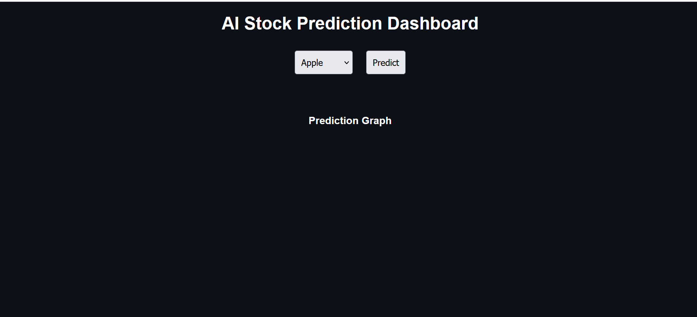
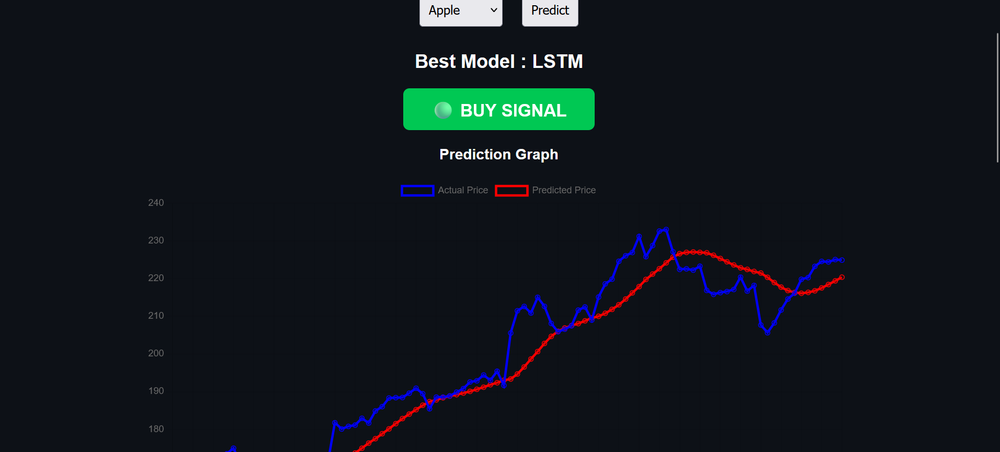
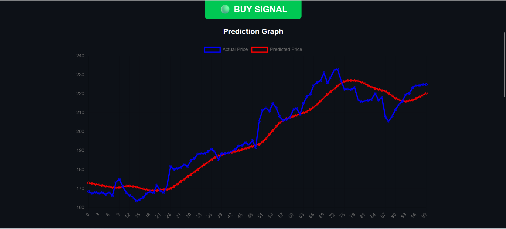
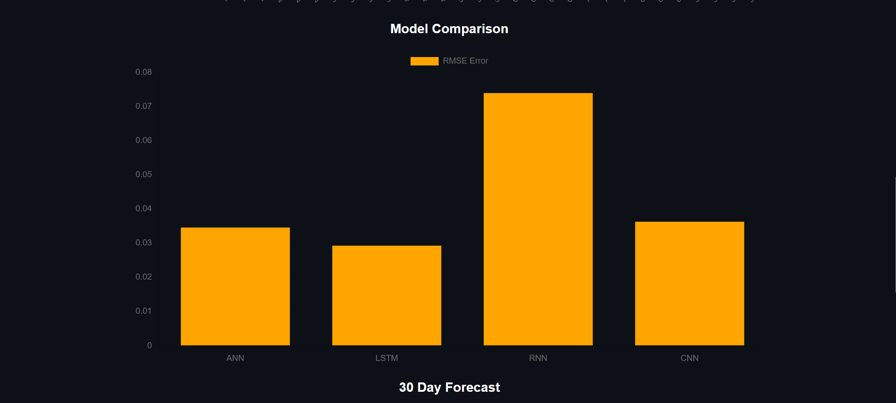
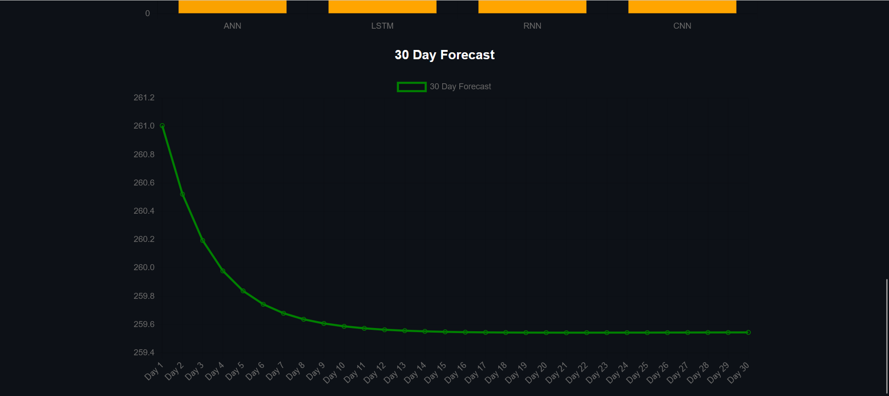

# 🚀 AI Stock Prediction Dashboard (FastAPI + Deep Learning)
# 📊 AI Stock Prediction Dashboard

An end-to-end **AI-powered stock prediction web application** built using **FastAPI and Deep Learning models**.

---

## 🚀 Features

* 📈 Real-time stock prediction (Apple, Google, Microsoft)
* 🤖 Multiple ML Models:

  * ANN
  * LSTM
  * RNN
  * CNN
* 📊 Model comparison using RMSE
* 🔮 30-day future forecast
* 💹 Buy / Sell / Hold signal
* 🌐 Interactive dashboard with charts

---

## 📸 Screenshots

### 🏠 Dashboard


### 📈 Prediction Graph


### 📊 Model Comparison


### 🔮 Forecast (30 Days)


### 💹 Buy/Sell Signal


---

## 💡 Key Highlights

- Built full-stack ML application using FastAPI
- Implemented 4 deep learning models
- Real-time stock data using yFinance API
- Interactive charts using Chart.js

## 🛠️ Tech Stack

### Backend

* FastAPI
* TensorFlow / Keras
* NumPy, Pandas
* Scikit-learn
* yFinance

### Frontend

* HTML
* CSS
* JavaScript
* Chart.js

---

## 📂 Project Structure

```
stock_prediction_project/
│
├── app.py
├── model.py
├── model_signal.py
├── utils.py
│
├── templates/
│   └── index.html
│
├── static/
│   ├── style.css
│   └── script.js
│
├── requirements.txt
├── .gitignore
└── README.md
```

---

## ⚙️ Installation

```bash
git clone https://github.com/beingshivamkumarsingh/Stock-Prediction.git
cd Stock-Prediction
pip install -r requirements.txt
uvicorn app:app --reload
```

---

## 🌐 Run Project

Open browser:

```
http://127.0.0.1:8000
```

---

## 📊 API Endpoints

* `/predict/{stock}` → prediction + forecast
* `/signal/{stock}` → buy/sell signal

---

## ⚠️ Notes

* Models are trained at runtime (for demo purpose)
* First run may take time
* Internet required for stock data

---

## 🔥 Future Improvements

* Save trained models
* Add more stocks
* Deploy online (Render / Railway)
* Improve UI (trading dashboard style)

---

## 👨‍💻 Author

**Shivam Kumar Singh**

---

## ⭐ Support

If you like this project, give it a ⭐ on GitHub!
